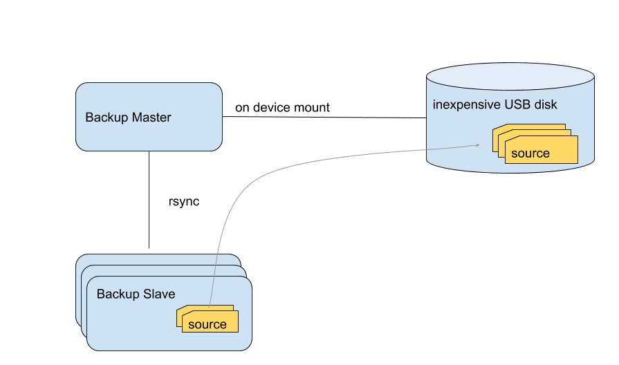

# Ansible Backup

This backup supports different strategies to backup files from services and mobile devices. 

# Backup Server - master & slave

Ansible playbook to set up hosts which files will be saved (group backup_slave) and backup targets which support backup (group backup_master). Each backup slave can have multiple sources. A shell script is generated to backup all slaves. USB backup devices can be configured with their mount path and backup will start automatically if USB device is being mounted after plug in. Systemd is used to start backup script on backup_master each time the backup device will be connected.

rsync is being used to support incremental backup, all rsync options are configurable for each backup slave.

This backup scenario is usefull for regular server backup using inexpensive USB disks. It is even possible to setup master and slave on the same machine, so backup will start when USB device is being plugged in.

# Backup Clients - target

The ansible playbook supports another goup named backup_target. A backup target is an accessible host on your network, which receives files from different devices. Each devices public ssh key is stored at backup target and the SSH connection is secured by using rrsync script as shell.

This backup scenario is usefull to backup (mobile) clients using rsync.